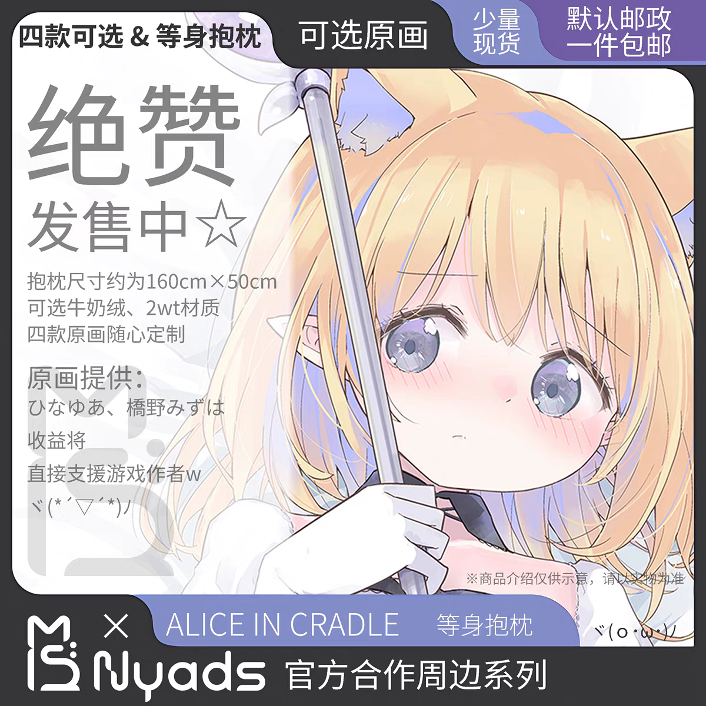
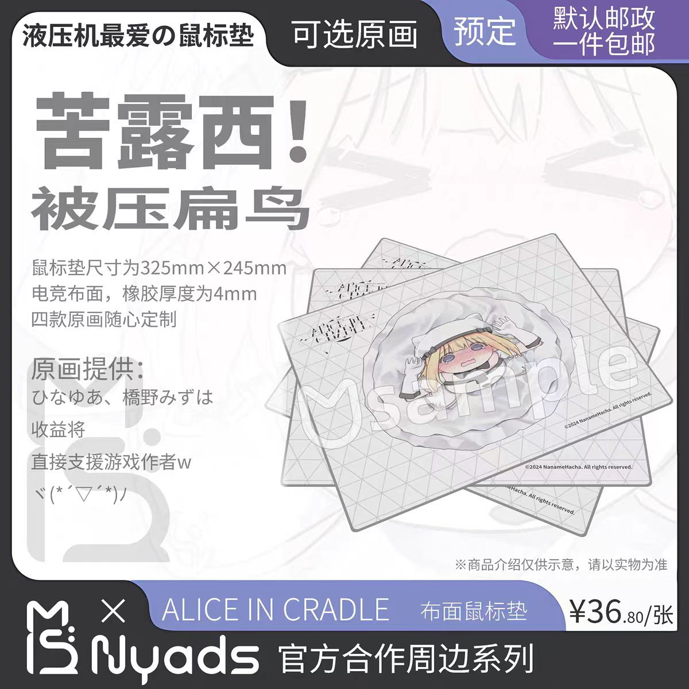
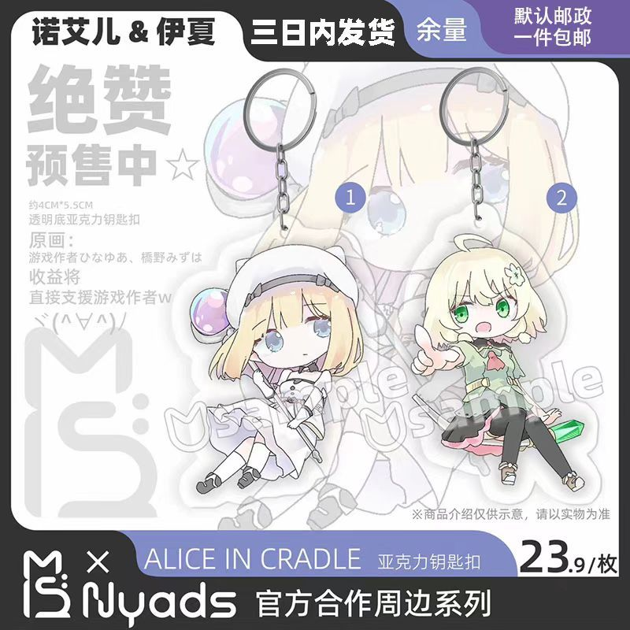
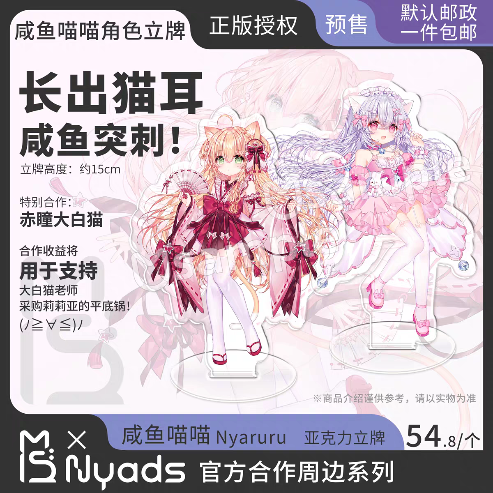
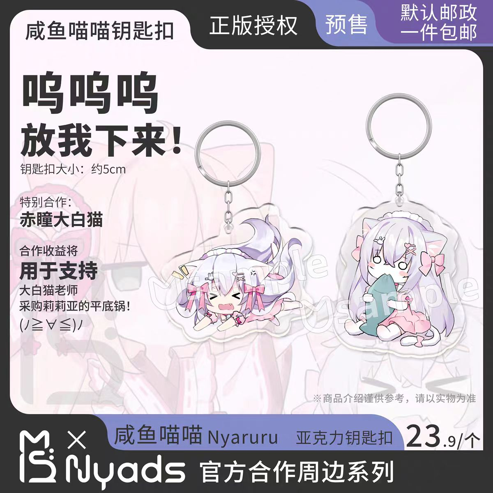
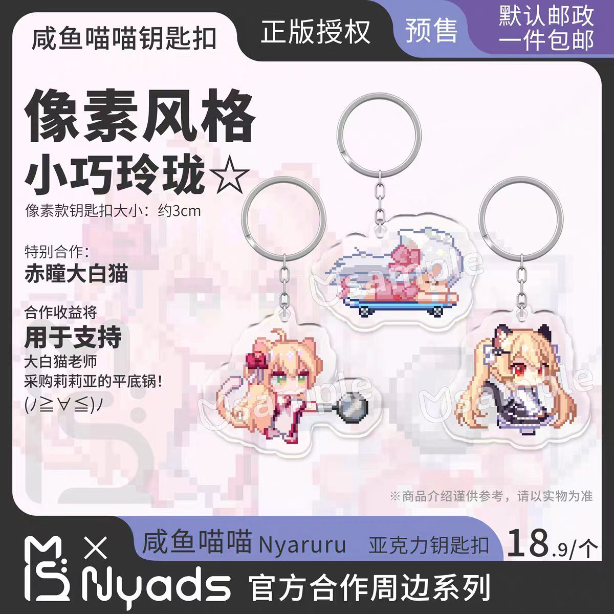

## 项目概要

[喵德斯](https://nyads.net/zh-hans) 致力于孵化二次元文化及相关产业，为每一位热爱创作的作者大大提供经济支持与成长平台~

> 不仅限于二次元产业，三次元项目经内部评估通过后，**同样可以申请合作❤**

## 项目优势

二次元周边孵化团队，依托源头A端工厂，提供 制造 → 宣发 → 销售 → 发货 一站式服务。

- **零**中间商差价，高效、可靠
- 打造高品质周边，提升 IP 口碑与市场占有率
- 助力游戏、动画IP推广，助力主播人气UP
- 面向全球服务，寄达世界大部分角落

我们追求的不只是产品，更是情怀与共鸣。

## 合作模式

我们诚挚邀请插画、漫画、轻小说、游戏设计等IP作品进行合作，同时也支持虚拟主播形象授权。**您提供版权授权，我们为您拓展销售渠道**，与您一起并肩前行。

对于具有潜力但暂时面临困难的作者，我们提供特别扶持，像伙伴一样陪伴您一路成长。

常见的授权方式：

- 单IP·单项目·单次授权
- 单IP复用·长期授权
- 长期个人版权授权
- 长期独家合作（对双方都有要求，且每次都会对IP的品类做评估）

## 分成比例

分成比例视合作模式而定，长期合作与独家授权可享更高比例分成。

- 长期合作 > 短期合作
- 独占授权 > 非独占授权

我们始终秉持互利共赢原则，通过**正式合同**为您提供可靠的分成保障。

## 品质与定价

参考淘宝「喵德斯企业店」。您拥有一定范围内的定价权，确保作品定价更符合粉丝预期与市场需求。

## 结算周期

没有额外的服务费用，按季度结算版税。

## 合作案例

### Alice In Cradle

Alice In Cradle Wiki: <https://aicwiki.com/zh/home>

#### 商品展示

[等身抱枕](http://e.tb.cn/h.TUXNXO0u1O18gfK?tk=q0n53CtQyEz)

[鼠标垫](http://e.tb.cn/h.TU0ABHRvC6YMw4q?tk=G5Eg3Ctr1NF)

[钥匙扣](http://e.tb.cn/h.TUXAzRkmrTXx9ys?tk=E2EK3CtvpI8)

### 咸鱼喵喵

steam: <https://store.steampowered.com/app/1478160/>

#### 商品展示

[立牌](http://e.tb.cn/h.TU0iBOywItGT8mB?tk=Z7eC3CtcCAR)

[钥匙扣](http://e.tb.cn/h.TU8O6wsx4aiIXlc?tk=u7vk3Ct88Wa)

[像素钥匙扣](http://e.tb.cn/h.TUXTHxWrio3th5O?tk=6TZI3Ct4DrP)

## 产品列表

我们支持制作以下类别

|     亚克力类（高透）   |  亚克力类（镭射） |
| :-------: | :-: |
|   5~6CM钥匙扣  | ✓ |
|  8CM立牌   |  ✓ |
|   10CM立牌  |   ✓ |
| 13CM立牌 |  ✓ |
|   15CM立牌  |   ✓ |

|     普通吧唧   |  镭射吧唧 | 双闪吧唧 | 柯式双闪吧唧 |
| :-------: | :-: |:-: |:-: |
|  58MM圆形吧唧  | ✓ | ✓ | ✓ |
|  75MM圆形吧唧   | ✓ | ✓ | ✓ |
|   方形吧唧  |  ✓  | ✓ | ✓ |
| 爱心吧唧 |  ✓  | ✓ | ✓ |
|   五角星吧唧  | ✓  | ✓ | ✓ |

|     电竞天然橡胶鼠标垫   |  洗脸毛巾 | 挂画 |
| :-------: | :-: |:-: |
|  445*350   | 20x100cm | 40*60 |
|   600*300  |   25x25cm | 40*80 |
| 600*350 |  30x30cm | 40*100 |
|   700*300 |   30x60cm | 40*120 |
|   700*400  |   30x70cm | 50*60 |
|   800*300  |   30x100cm| 50*80 |
|   800*400  |   35x75cm | 50*120 |
|   800*500  |   35x100cm | 50*150 |
|   900*300  |   40x60cm | 60*90 |
|  900*400  |   50x100cm | 60*120 |
|   900*500  |   70x140cm | 60*170 |
|   1000*500  |   80x180cm | 90*120 |
|   1200*600  |   | 90*200 |

|     抱枕类（短毛绒双面印刷）   |  抱枕类（2WT/2WAY双面印刷） | 异形抱枕类 |
| :-------: | :-: |:-: |
|  40*40   | ✓ | ✓ |
|   45*45  |   ✓ | ✓ |
| 50*50 |  ✓ | ✗ |
|   40*120 |   ✓ | ✗ |
|   50*160  |   ✓ | ✗ |
|   50*180  |   ✓| ✗ |

|     纸制品   |  硅胶制品 | 杯子/杯垫 |
| :-------: | :-: |:-: |
|  A6明信片   | 100克内 | 热转印马克杯 |
|  A6明信片印刷 |    | 高温印花马克杯 |
| A3海报 |   | 高温印花V字杯 |
|   A3海报印刷 |    | 高温印花白瓷盘 |
|    |    | 陶瓷杯垫 |

|     普通镭射票   |  逆向镭射票 | PVC透卡
| :-------: | :-: |:-: |
|  21*7  | 21*7 | 85.5*54mm |
|  18*6   | 18*6 |  |

|     袜子（纯棉）   |  T恤 | 公仔 |
| :-------: | :-: |:-: |
|  通码刺绣   | 烫画 | 20CMfufu |
|  通码印刷 | 数码直喷   | 25CMfufu |
|  |  胶印 | 40CMfufu |
|   |  刺绣  | 手偶 |
|    |  油墨丝网印  | 动物公仔 |
|    |    | 趴趴团子 |
|    |    | 轻粒子团子 |
|    |    | 重粒子团子 |

|     金属徽章   |  流沙亚克力（按需定制） | 塑料卡套 | 磁吸冰箱贴 |
| :-------: | :-: |:-: |:-: |
|  烤漆5CM  | 9*6 | 全彩卡套 | 5CM |
|  珐琅5CM   |  |  | 27CM |
|   |    |  | 35CM |

|     棒棒糖   |  口罩 | 亚克力横版台历 | 硅藻泥地垫 | 化妆包 |
| :-------: | :-: |:-: |:-: |:-: |
|  单面裸糖  | KF94 | A5 13P | 60CM*90CM | 数码印方形包带拉链 |
|  双面裸糖   | KN95 |  |  |  |
|  包装袋 |  防尘口罩  |  |  |  |
|  其他装饰品 |    |  |  |  |

|     御守   |  发货胶带 | U型颈枕 | 帆布袋 |移动电源 |
| :-------: | :-: |:-: |:-: |:-: |
|  彩印  | 单色印刷 | 记忆棉 | 40*30CM | 聚合物5000毫安 慢充 |
|  织唛绣花   |  |  |  |聚合物10000毫安 慢充  |
|     |  |  |  |10000毫安快充  |
|     |  |  |  |其他要求  |

## 让我们一起点亮二次元

我们相信每一个IP都值得被看见，每一份创作都值得被珍视。如果您有意与我们合作，或者想推荐您身边的宝藏作者，欢迎随时联系我们！

一起让二次元的热爱，绽放出更耀眼的光芒✨

## 联系方式

### Lee

- Email: <lee@nyads.net>
