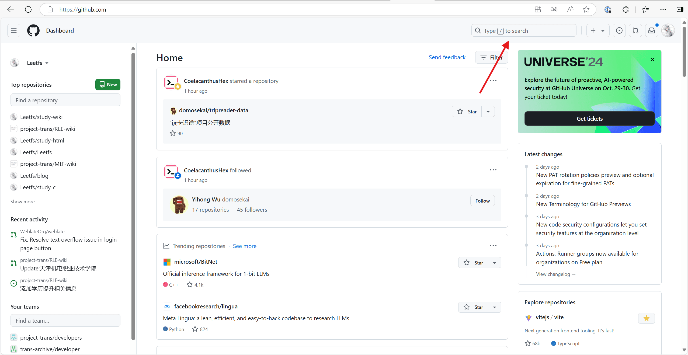
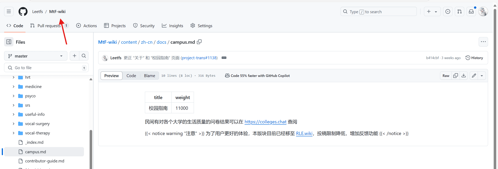

### 所需工具

- vscode（可选）
- Git（可选）
- 一个浏览器

## GitHub

### 初识 GitHub

GitHub 是一个大型开源社区，您可以自由的为您喜欢的项目做出贡献。

GitHub 官网: <https://github.com/>

### 我该如何做贡献？

注册账号（此处略）

打开首页，通过搜索栏找到想要做出贡献的仓库，也可以通过仓库链接直接跳转。

在仓库代码页（首页），点击 Fork，复制仓库到你的账号下。

 

进入你分叉出的仓库

找到想要编辑的文件进行编辑，编辑后点击右上角保存。

 

所有文件修改完毕后，返回仓库主页，并发起一个拉取请求。

 

填写你的标题（必选）和 简介（可选），点击发送。

等待上游仓库管理员合并你的拉取请求

### 小技巧

在 GitHub 仓库页按下 `.` 键可以切换到网页版 vs code，在这个编辑器内编辑有时比原生的编辑器更好用。

> 您可以使用[此仓库](https://github.com/Leetfs/blog)练习，从补全缺失的标点符号/修复错别字开始吧~

## 常见问题

此处为教新人时遇到过的问题，持续更新ing

### 找不到分叉出的仓库了怎么办？

点击右上角你的头像，在弹出的侧边栏内选择 `Your repositories`

在页面内选择你想切换到的仓库

### 在我的 PR 被合并前仓库内有了新的提交怎么办？

如果没有合并冲突，可以不理会；如果有合并冲突，需要先解决合并冲突。

**注意：**\
> 点击仓库名下方的 `Forked from ...` 可跳转到上游仓库，但通常情况下您只可以通过 PR（拉取请求）的形式将更改推送到上游，除非您拥有对上游仓库的直接推送权限。

## 关于使用 vscode 和 git 进行推送

见本系列内的其他文章
