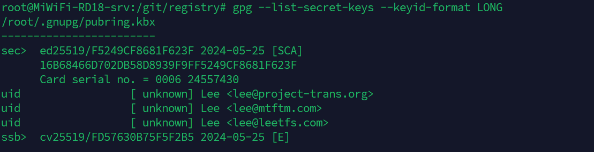
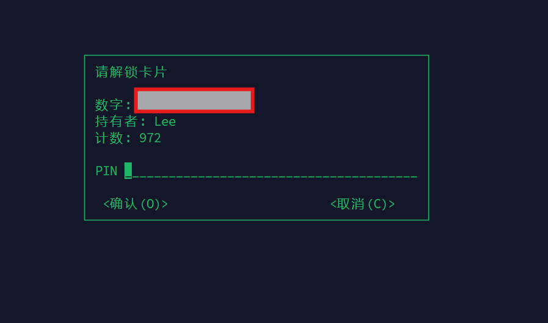

### 排查问题

使用终端连接服务器，调 yubikey 内的 GPG 密钥签 Git 提交时提示错误，简要排查：


验证是否有有效私钥：

```bash
gpg --list-secret-keys --keyid-format LONG
```



测试是否正确读取智能卡：

```bash
gpg --card-status
```


直接使用 GPG 测试签名：

```bash
echo "test" | gpg --clearsign
```

获得输出：

```bash
-----BEGIN PGP SIGNED MESSAGE-----
Hash: SHA256

test
gpg: signing failed: Inappropriate ioctl for device
gpg: [stdin]: clear-sign failed: Inappropriate ioctl for device
```

观察报错发现，多终端环境下 GPG 无法自动识别当前正在使用的终端设备，导致不能正确的将 PIN 码输入提示传递给用户，配置 GPG_TTY 环境变量尝试修复：

```bash
export GPG_TTY=$(tty)
```

重新测试签名：



成功弹出校验框，至此问题解决。
